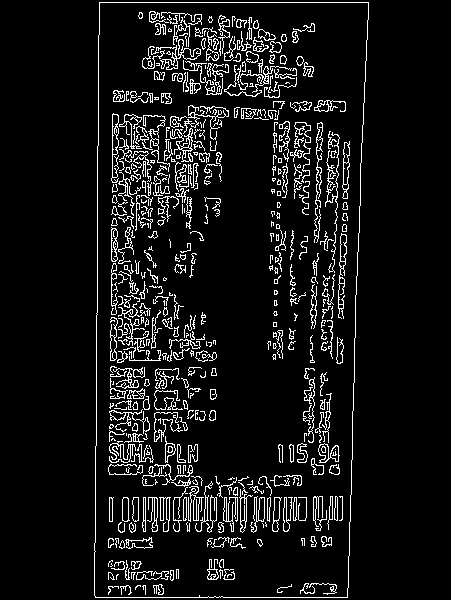
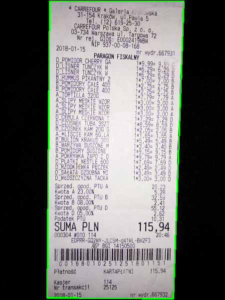
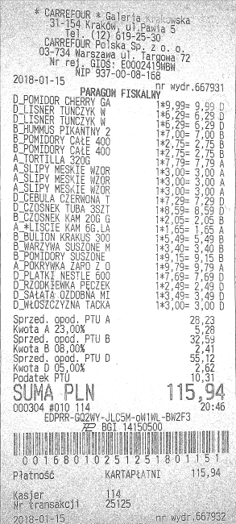

# scanner-ocr

## Installation
```
pip install -r requirements.txt
```

## Scanning step

Scanning process has been further divided into 3 steps:
- edge detection
  - convert image to grayscale (`cv2.cvtColor`)
  - apply Gaussian blur with 5x5 kernel size and sigmaX = 0 to remove high frequency noise (`cv2.GaussianBlur`)
  - use Canny algorithm to detect edges (`auto_canny` from `imutils`, which uses `cv2.Canny`)
- finding contours
  - find approximation of contours as a polygon (`cv2.findContours` and `cv2.approxPolyDP`)
  - if polygon has 4 sides - finish, else find a minimum rectangle inscribed in the polygon (`cv2.minAreaRect`)
- applying perspective transformation
  - obtain "bird's eye view" of the image (`cv2.getPerspectiveTransform` and `cv2.warpPerspective`)
  - give image a "black and white feel" as if it was a result of using a real scanner (`threshold_local` from `scikit-image`)

Tutorials used during implementation:
- https://www.pyimagesearch.com/2014/08/25/4-point-opencv-getperspective-transform-example/
- https://www.pyimagesearch.com/2014/09/01/build-kick-ass-mobile-document-scanner-just-5-minutes/

## OCR step

## Example

- image after edge detection: 



- image after finding contours:



- image after perspective transformation:



- output:
```
_ D_POMIDOR CHERRY GA         0.0
~~ DLLTISNER TUNCZYK WoO      6.29
- DILISNER TUNEZ¥K 4          6.79
~ B_HUMMUS PIKANTNY 2         7.0
B_POMIDORY CALE 400           7.75
— B_POMIDORY CALE 460         2.75
A TORTILLA 3706               7.759
— ALSLIPY MESKTE WZ0R         3.0
A_SLIPY MESKTE W70R           3.0
A_SLIPY MESKIE WOR            3.0
- D_CEBULA CZERWONA 7         7.29
D-CZOSNEK TUBA 3SZT           8.53
— B_CZOSNEK KAM 206 G         2.05
A_*LISCIE KAM 6G.LA           1.55
~ B_BULTON KRAKUS 300         5.49
~B_WARZYWA SUSZONE M          3.4
B_POMIDORY SUSZONE            9.15
A-POKRYWKA ZARO Z 0           9.79
D_PLATKI NESTLE 800           7.69
D _RZODKEEWKA PECZEK          7.49
D_SAtATA.OZDOBNA MI           3.49
D_WrOSZCZYZNA TACKA           3.0
Sum: 116.26
```